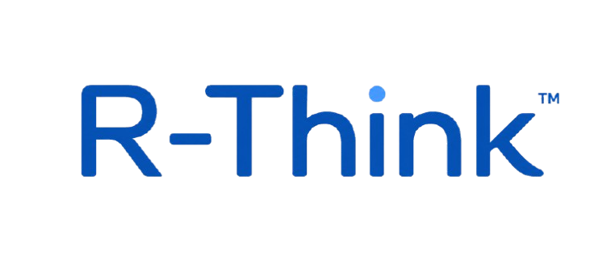

<p align="center">
  
</p>

# R-Think Runtime

> **Cognitive Reasoning Algorithm, Protocol, Runtime, and Evidence-Governed Execution System**

R-Think bukan prompt dan bukan checklist teori. R-Think Runtime adalah software yang mengendalikan state kognitif operasional, metode, evidence, authority, transition, failure, discovery, dan evolution secara observable serta dapat diuji.


---

## Table of Contents

- [What is R-Think](#what-is-r-think)
- [The Problem It Solves](#the-problem-it-solves)
- [Canonical R-Think Algorithm](#canonical-r-think-algorithm)
- [State Machine](#state-machine)
- [Non-Negotiable Principles](#non-negotiable-principles)
- [Architecture](#architecture)
- [Tech Stack](#tech-stack)
- [Quick Start](#quick-start)
- [Project Structure](#project-structure)
- [Current Status](#current-status)
- [Roadmap](#roadmap)
- [Development](#development)
- [Authority](#authority)
- [License](#license)

---

## What is R-Think

R-Think berangkat dari **Iqra/Perhatikan**: kemampuan untuk memperhatikan realitas sebelum memutuskan. Urutannya bukan ritual, melainkan **discipline** agar pemahaman, validasi, hubungan, challenge, discovery, dan evolution tidak dipotong oleh dorongan untuk segera menghasilkan jawaban.

R-Think is a **Guardian reasoning framework**: Observe (Iqra) → Understand → Question → Validate → Connect → Challenge → Discover → Evolve. This blueprint transforms that framework into an **executable system** that governs AI/agent operational processes — without claiming to read all internal hidden reasoning of the model.

R-Think Runtime **controls what can be controlled**: work state, input, artifact, method, tool, evidence, transition, authority, action, actual result, contradiction, completion, and evolution.

The system stands alone. **CG OS** is the primary consumer, **OpenCode** can be an executor, and projects like OCR/DIP or KDAP can provide domain blueprints and tools. Models can be changed without altering R-Think identity and protocol.

### Product Forms

| Form | Definition |
|------|-----------|
| **R-Think Algorithm** | Rules for selecting and running processes from observation to evolution |
| **R-Think Protocol (RTP)** | Message contract between runtime, model, executor, tool, verifier, and human |
| **R-Think Runtime** | Engine managing mission, state, transitions, artifacts, evidence, authority, and recovery |
| **R-Think Artifact Standard** | Schema for observation, claim, hypothesis, validation, challenge, discovery, decision, evolution |
| **R-Think Evidence Graph** | Traceable relationships: source → claim → evidence → decision → result → contradiction |
| **R-Think SDK** | Library/API/CLI for application integration |
| **R-Think Inspector** | UI for viewing process, evidence, gaps, transitions, and status |

---

## The Problem It Solves

| Problem | How R-Think Addresses It |
|---------|-------------------------|
| Models appear to follow frameworks by generating 8-stage narratives | Enforces observable state transitions with artifact gates |
| Executors skip observation, inject assumptions, claim completion | Requires evidence before completion; artifacts before transition |
| Prompts don't guarantee persistence, recovery, authority, or evidence | Runtime maintains operational state independently of chat history |
| Chat history is not factual mission state | Event-sourced operational history with replay |
| Vector memory doesn't prove claim-evidence relationships | Evidence Graph with traceable source→claim→evidence links |
| Tool-call success doesn't prove product behavior is correct | Actual result distinguished from executor report |
| Failures stop at "blocked" or get hardcoded closed | Contradiction triggers challenge and evolution loops |
| Model upgrades change behavior without traceability | Versioned evolution with benchmarks and rollback |
| Multi-agent workflows become prompt collections without shared reasoning | Single canonical algorithm governs all actors |

---

## Canonical R-Think Algorithm

```
INPUT: intent | event | mission

 1. Establish purpose, scope, authority, risk, novelty, and acceptance.
 2. OBSERVE   — The initial stage where the Guardian absorbs information without filters.
                 Reading reality as it is — without premature interpretation.
                 Iqra is not merely reading text, but reading situations, patterns, and context.
 3. UNDERSTAND — Building a mental model from observations.
                  The Guardian does not merely collect data, but seeks meaning and relationships within it.
 4. QUESTION   — Testing understanding through critical questions.
                  Is the mental model accurate? What is still unknown?
 5. VALIDATE   — Confirming understanding through experiments or cross-referencing.
                  Validation is the bridge between belief and truth.
 6. CONNECT    — Linking new findings to existing knowledge.
                  Discovery does not happen in a vacuum — it grows upon established foundations.
 7. CHALLENGE  — The most critical stage. Challenge prevents overconfidence by re-questioning
                  the entire chain. What will happen? Which assumption is wrong? Which part
                  remains uncovered? Is there another approach? Can the experiment be repeated?
 8. DISCOVER   — Arriving at new findings that have passed through the entire filter —
                  observation, understanding, validation, and challenge.
                  Discovery here is not merely "finding", but finding with tested confidence.
 9. EVOLVE     — Incorporating findings into the next cycle.
                  R-Think is a living framework — it evolves each time a cycle completes,
                  growing sharper and deeper.
10. Execute only authorized actions; capture actual result.
11. Re-enter OBSERVE when reality contradicts expectation.
12. Complete only when acceptance evidence passes.
```

### Adaptive Depth

| Level | Use Case | Required Behavior |
|-------|----------|-------------------|
| **L0 Routine** | Read/status/simple deterministic action | Observe–understand–act–verify lightweight |
| **L1 Controlled** | Bounded edit/configuration | Validate inputs and verify actual result |
| **L2 Significant** | Feature, architecture, uncertain investigation | Full R-Think with challenge and evidence |
| **L3 Critical** | Security, deletion, protocol/blueprint/human impact | Full cycle + independent verifier + explicit authority |

### Loop Rules

- Sequence is canonical but runtime is **not strictly linear**
- **Contradiction** returns to Observe or Validate
- **Insufficient method** routes to Challenge and Experiment
- **New relationship** may return to Understand/Question
- **Evolution** may create a new mission rather than mutate the active mission
- Retries require **changed hypothesis, method, context, or evidence** — not blind repetition

---

## State Machine

### Primary Cognitive States

```
OBSERVE → UNDERSTAND → QUESTION → VALIDATE → CONNECT → CHALLENGE → DISCOVER → EVOLVE
```

| State | Essence |
|-------|---------|
| **Observe (Iqra)** | Absorbing information without filters. Reading reality as it is — without premature interpretation. Not merely reading text, but reading situations, patterns, and context. |
| **Understand** | Building a mental model from observations. Not merely collecting data, but seeking meaning and relationships within it. |
| **Question** | Testing understanding through critical questions. Is the mental model accurate? What is still unknown? |
| **Validate** | Confirming understanding through experiments or cross-referencing. The bridge between belief and truth. |
| **Connect** | Linking new findings to existing knowledge. Discovery does not happen in a vacuum — it grows upon established foundations. |
| **Challenge** | The most critical stage. Prevents overconfidence by re-questioning the entire chain. What will happen? Which assumption is wrong? Which part remains uncovered? Is there another approach? Can the experiment be repeated? |
| **Discover** | Arriving at new findings that have passed through the entire filter — observation, understanding, validation, and challenge. Not merely "finding", but finding with tested confidence. |
| **Evolve** | Incorporating findings into the next cycle. R-Think is a living framework — it evolves each time a cycle completes, growing sharper and deeper. |

### Operational States

| State | Meaning |
|-------|---------|
| `WAITING_FOR_EVIDENCE` | Paused until evidence is available |
| `WAITING_FOR_AUTHORITY` | Paused until human/Guardian decision |
| `EXECUTING_METHOD` | Actively running a method or tool |
| `EXECUTING_EXPERIMENT` | Running a bounded experiment |
| `CONTRADICTION_DETECTED` | Expected vs actual conflict found |
| `METHOD_INSUFFICIENT` | Current method cannot proceed |
| `REVISION_REQUIRED` | Backtrack and revise approach |
| `COMPLETED` | Acceptance evidence passed |
| `PARTIAL` | Partial completion with known gaps |
| `FAILED` | Execution failed |
| `BLOCKED` | Cannot proceed — external dependency |
| `INVALID` | State or input is invalid |

### Transition Decisions

| Decision | Meaning |
|----------|---------|
| `ALLOW` | Transition permitted — requirements satisfied |
| `DENY` | Transition blocked — requirements not met |
| `DEFER` | Transition postponed — awaiting condition |
| `ESCALATE` | Transition requires higher authority |

---

## Non-Negotiable Principles

| Principle | Operational Meaning |
|-----------|-------------------|
| **Reality before narrative** | Actual result defeats executor/model report |
| **Artifacts before transition** | State doesn't move without required artifact |
| **Evidence before completion** | Completion requires acceptance evidence |
| **Unknown remains unknown** | Uncertainty is stated, not covered with false confidence |
| **Challenge before material decision** | Novel/high-risk/material decisions must be challenged |
| **History before cleanliness** | Failure/revision is not overwritten to look clean |
| **Evolution with authority** | Material changes are versioned and approved |
| **Model independence** | Runtime is not bound to one LLM/provider |
| **Local/open-source baseline** | No mandatory cloud, account, credit card, or recurring cost |

---

## Architecture

### Runtime Modules

| Module | Responsibility |
|--------|---------------|
| **Mission Runtime** | Lifecycle, dependencies, recovery |
| **State Machine** | Current state and allowed transitions |
| **Transition Engine** | Rule evaluation and authority checks |
| **Artifact Registry** | Schema validation and provenance |
| **Evidence Graph** | Claims, evidence, contradiction, acceptance |
| **Method Router** | Select model/tool/human/experiment |
| **Challenge Engine** | Coverage, alternative, failure mode |
| **Evolution Engine** | Version, benchmark, rollback, approval |
| **Policy Engine** | Capability and security decisions |
| **Provider Adapters** | Local models, OpenCode, tools, human |
| **Event Store** | Immutable operational history |
| **Inspector API/UI** | Observable process and evidence |

### Evidence Graph

```
SOURCE ──OBSERVED_AS──▶ OBSERVATION
OBSERVATION ──SUPPORTS|CONTRADICTS──▶ CLAIM
CLAIM ──FORMULATES──▶ HYPOTHESIS
HYPOTHESIS ──TESTED_BY──▶ EXPERIMENT
EXPERIMENT ──PRODUCES──▶ EVIDENCE
EVIDENCE ──SUPPORTS|REFUTES──▶ DECISION
DECISION ──AUTHORIZES──▶ ACTION
ACTION ──PRODUCES──▶ ACTUAL_RESULT
ACTUAL_RESULT ──SATISFIES|VIOLATES──▶ ACCEPTANCE
CONTRADICTION ──TRIGGERS──▶ CHALLENGE|REVISION
```

### Actor Authority Boundaries

| Actor | Allowed | Not Allowed |
|-------|---------|-------------|
| **Bro Kraken** (Human Architect) | Final authority on meaning, doctrine, evolution | — |
| **Guardian** (Architecture Guardian) | Approve/reject material transition/evolution | Fabricate evidence |
| **Executor** (OpenCode/AI) | Implement bounded mission, submit artifacts/evidence | Self-approve completion, expand scope |
| **Model** | Produce cognitive artifact, request tool/transition | Execute unrestricted tool directly |
| **Tool** | Return actual result | Interpret completion |
| **Verifier** | Evaluate acceptance independently | Rewrite executor history |
| **Human** | Provide intent/decision/authority | — |

---

## Tech Stack

| Layer | Technology | Notes |
|-------|-----------|-------|
| **Runtime** | Node.js + TypeScript | Strong contracts and realtime orchestration |
| **Schemas** | JSON Schema + Zod | Protocol validation (compile-time + runtime) |
| **Testing** | Vitest | Contract and replay tests |
| **Database** | PostgreSQL *(planned)* | Factual state, events, lineage |
| **Semantic** | pgvector *(planned)* | Candidate retrieval only |
| **Events** | NATS *(planned, license verify)* | Persistent event transport |
| **Policy** | Custom typed policy / OPA *(planned)* | Authority evaluation |
| **Inference** | Ollama + llama.cpp adapters *(planned)* | Local model independence |
| **Executor** | OpenCode adapter *(planned)* | Bound coding mission |
| **Tools** | MCP / OpenAPI / custom local adapters *(planned)* | Capability-scoped |
| **Inspector** | Next.js / local web UI *(planned)* | State/evidence visualization |
| **Observability** | OpenTelemetry-compatible local stack *(planned)* | Metrics and trace |
| **Container** | Docker Engine / Podman *(planned)* | Avoid mandatory Docker Desktop |

All components must pass the **License Gate**: open-source/open-weight status, commercial use, offline capability, telemetry, account, credit card, pinned version, replacement, and rollback.

---

## Quick Start

### Prerequisites

- **Node.js** >= 18.0.0
- **npm** (pnpm also supported)

### Installation

```bash
# Clone the repository
git clone <repository-url>
cd r_think

# Install dependencies
npm install
```

### Development Commands

```bash
# Type checking (strict mode)
npm run typecheck

# Run all contract tests
npm test

# Run tests in watch mode
npm run test:watch

# Build for production
npm run build
```

### Verify Everything Works

```bash
npm install && npm run typecheck && npm test && npm run build
```

Expected output: 65/65 tests passing, zero type errors, clean build.

---

## Project Structure

```
r_think/
├── LICENSE                     # AGPL-3.0-only (full official text)
├── DOCUMENTATION-LICENSE.md    # CC-BY-SA-4.0 documentation license
├── NOTICE                      # Copyright, attribution, third-party obligations
├── AUTHORS.md                  # Contributor roles and attribution
├── TRADEMARKS.md               # R-Think™ trademark reservation policy
├── CITATION.cff                # Academic citation metadata (CFF v1.2.0)
├── package.json                # Project config, scripts, dependencies
├── tsconfig.json               # TypeScript strict configuration
├── vitest.config.ts            # Test runner configuration
├── README.md                   # This file
├── TRACKER.md                  # Living project tracker
│
├── raw/                        # Source documents (blueprint)
│   └── R-Think_Runtime_Master_Blueprint_v1.0.docx
│
├── src/
│   ├── index.ts                # Public API exports
│   ├── contracts/
│   │   ├── types.ts            # Canonical enums and type definitions
│   │   └── index.ts            # TypeScript interfaces (Mission, RTP, Artifact, Transition)
│   └── schemas/
│       ├── index.ts            # Zod runtime validators
│       ├── json-schema.ts      # JSON Schema definitions
│       └── validation.ts       # DERIVED policy validators
│
├── tests/
│   ├── contracts/
│   │   ├── rthink-rt-001.test.ts     # Zod validation tests (25 tests)
│   │   └── json-schema.test.ts       # JSON Schema tests (40 tests, ajv)
│   └── fixtures/
│       ├── valid/               # Valid protocol fixtures
│       └── invalid/             # Invalid protocol fixtures (rejection test data)
│
└── docs/
    ├── pictures/
    │   ├── logo.png             # R-Think primary logo
    │   ├── rthink_flow.png      # R-Think flow diagram
    │   └── favicon_io/          # Favicon assets (7 files)
    ├── brand/
    │   └── RTHINK-BRAND-ASSET-INVENTORY.md
    ├── governance/
    │   └── RTHINK-IP-PROVENANCE.md
    ├── decisions/
    │   ├── RTHINK-RT-001_LICENSE-GATE.md
    │   └── RTHINK-IP-001_LICENSE-ARCHITECTURE.md
    ├── evidence/
    │   └── RTHINK-RT-001-R1_EVIDENCE-MANIFEST.md
    └── reports/                 # All mission reports (preserved)
```

---

## Current Status

| Mission | Level | Status |
|---------|-------|--------|
| RTHINK-RT-001 | L2 | SUPERSEDED BY CORRECTION PROCESS |
| RTHINK-RT-001-R1 | L2 | PARTIAL — GOVERNANCE EVIDENCE INCOMPLETE / REVISION_REQUIRED |
| RTHINK-GIT-001 | L2 | PUBLISHED — GUARDIAN VERIFICATION INCOMPLETE |
| RTHINK-IP-001 | L3 | REVISION_REQUIRED |
| RTHINK-IP-001-R1 | L3 | READY FOR GUARDIAN AND HUMAN ARCHITECT REVIEW |
| RTHINK-RT-001-R2 | — | NOT AUTHORIZED |
| RTHINK-RT-002 | — | NOT AUTHORIZED |
| NPM PUBLICATION | — | NOT AUTHORIZED |

### RTHINK-RT-001 — Implemented

| Artifact | Status |
|----------|--------|
| Repository baseline | IMPLEMENTED — ACCEPTANCE PENDING |
| TypeScript + Node.js workspace | Working |
| Canonical enums (8) | IMPLEMENTED — ACCEPTANCE PENDING |
| Zod validators (4 schemas) | IMPLEMENTED — ACCEPTANCE PENDING |
| JSON Schema definitions (4 schemas) | IMPLEMENTED — ACCEPTANCE PENDING |
| Valid fixtures (5) | Passing |
| Invalid fixtures (14) | Rejected correctly |
| Contract tests (65) | All passing |
| License Gate (6 dependencies) | All pass (MIT, Apache-2.0) |
| TypeScript strict typecheck | Passing |
| Build | Passing |

---

## Roadmap

### Phase 1: Formal Specification *(RTHINK-RT-001 — IMPLEMENTED, ACCEPTANCE PENDING)*
- [x] Repository baseline
- [x] Canonical types and enums
- [x] JSON Schemas + Zod validators
- [x] Valid/invalid fixtures
- [x] Contract tests
- [x] License Gate

### Phase 2: State Machine & Transitions *(planned)*
- [ ] Runtime state machine engine
- [ ] Adaptive-depth policy enforcement
- [ ] Illegal transition denial
- [ ] Transition rule versioning

### Phase 3: Artifacts & Evidence Graph *(planned)*
- [ ] Artifact registry with schema validation
- [ ] Evidence graph relationships
- [ ] Required artifact gates
- [ ] Claim-evidence linking

### Phase 4: Method/Provider Router *(planned)*
- [ ] Provider interface (CognitiveProvider)
- [ ] Mock/deterministic providers
- [ ] Local model adapters (Ollama, llama.cpp)
- [ ] Tool routing

### Phase 5: Persistence & Recovery *(planned)*
- [ ] PostgreSQL event state
- [ ] Recovery at every state
- [ ] Replay from event stream
- [ ] Restart resumes factual state

### Phase 6: Executor Integration *(planned)*
- [ ] OpenCode adapter
- [ ] Executor cannot self-complete
- [ ] Revision loop

### Phase 7: Inspector & Real Mission *(planned)*
- [ ] Inspector UI
- [ ] Real mission challenge
- [ ] Evidence-based accept/revise result

### Production v1 *(8-12 weeks)*
- Security hardening
- Multi-executor support
- Replay and benchmarks

---

## Development

### Adding New Schemas

1. Define types in `src/contracts/types.ts`
2. Add interface in `src/contracts/index.ts`
3. Create Zod validator in `src/schemas/index.ts`
4. Create JSON Schema in `src/schemas/json-schema.ts`
5. Add valid/invalid fixtures in `tests/fixtures/`
6. Write contract tests in `tests/contracts/`
7. Run `npm test` to verify

### Adding New Enums

Only add enum values that are explicitly defined in the blueprint (RTHINK-BP-001). Do not silently add semantic states or decision types. If a new value is needed:

1. Confirm it exists in the blueprint
2. If DERIVED, classify it as such in documentation
3. If PROVISIONAL, await Guardian confirmation

### Blueprint Traceability

Every implementation artifact must reference the relevant RTHINK-BP-001 requirement or section. Use the format:

```
// RTHINK-BP-001 §7.2: Transition Decision
```

### Commit Convention

```
<type>(<scope>): <description>

Types: feat, fix, docs, test, refactor, chore
Scopes: contracts, schemas, tests, fixtures, docs
```

---

## Authority

| Role | Person |
|------|--------|
| **Human Architect & Final Doctrine Authority** | Hendri RH — Bro Kraken |
| **Architecture Guardian** | Bro CG |
| **Primary Consumer** | CG OS |

---

## Brand & Intellectual Property

| Asset | Location |
|-------|----------|
| Primary logo | [docs/pictures/logo.png](docs/pictures/logo.png) |
| Favicon assets | [docs/pictures/favicon_io/](docs/pictures/favicon_io/) |
| Flow diagram | [docs/pictures/rthink_flow.png](docs/pictures/rthink_flow.png) |
| Brand asset inventory | [docs/brand/RTHINK-BRAND-ASSET-INVENTORY.md](docs/brand/RTHINK-BRAND-ASSET-INVENTORY.md) |
| Trademark policy | [TRADEMARKS.md](TRADEMARKS.md) |
| IP provenance | [docs/governance/RTHINK-IP-PROVENANCE.md](docs/governance/RTHINK-IP-PROVENANCE.md) |

---

## License

### Software

Source code, schemas, validators, tests, and fixtures are licensed under the
**GNU Affero General Public License v3.0 only** (AGPL-3.0-only).

See [LICENSE](LICENSE) for the full license text.

### Documentation

Framework documentation, blueprint text, diagrams, and written explanations are
licensed under **Creative Commons Attribution-ShareAlike 4.0 International**
(CC-BY-SA-4.0).

See [DOCUMENTATION-LICENSE.md](DOCUMENTATION-LICENSE.md) for details.

### Trademark

The R-Think name, R-Think™ wordmark, and R-Think logo are **not** granted
under any open license. Trademark rights are reserved separately.

See [TRADEMARKS.md](TRADEMARKS.md) for the trademark policy.

### Third-Party Dependencies

All direct dependencies are open-source:

- **zod** 3.25.67 — MIT
- **ajv** 8.20.0 — MIT
- **ajv-formats** 3.0.1 — MIT
- **typescript** 5.8.3 — Apache-2.0
- **vitest** 3.2.7 — MIT
- **@types/node** 22.15.31 — MIT

See [NOTICE](NOTICE) for complete attribution.

### Citation

```bibtex
@software{rh2026rthink,
  author = {Hendri RH},
  title = {R-Think Runtime},
  year = {2026},
  url = {https://github.com/kraken-backend/r-think_framework},
  license = {AGPL-3.0-only}
}
```

Or use [CITATION.cff](CITATION.cff) directly.

---

*Built with discipline. Governed by evidence. Evolved with authority.*
